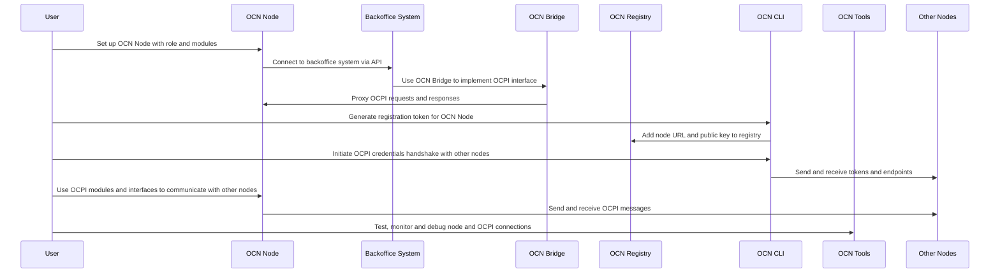

# Open Charging Network

Open Charging Network (OCN) is an open and decentralized network for electric vehicle charging and e-mobility services. It uses OCPI protocol, Energy Web Chain (EWC) and OCN Registry to enable secure and authorized peer-to-peer communication between different parties on the network.

## Evaluate OCN and its components

The main components of the OCN are as follows:

- **OCN Node:** The OCN node is a software module that setup a communication layer between OCPI protocol and the OCN Registry. It is based on the OCPI 2.2 and supports various modules such as credentials, tokens, locations, tariffs, sessions, cdrs, and commands.

- **OCN Registry:** OCN Registry is a smart contract deployed on the Energy Web Chain that stores and verifies the OCN Node URLs and public keys of the participants.

- **OCN Tools:** This is a set of tools for testing, monitoring and debugging OCN Nodes and OCPI connections.

- **OCN Bridge:** The OCN bridge enables charging point operators (CPOs) and other open charge point interface (OCPI) parties to connect their existing systems with the OCN protocol.

- **OCN CLI:** This is a command-line interface for interacting with the OCN Registry and managing OCN Nodes.

## How OCN can be used to register users and assets

The diagram shows the steps involved in setting up and using an OCN node.

## Identify the benefits and challenges of using OCN

Some of the benefits are:
- Full control over identity and data on the network
- Enhances privacy and security on the network
- Reduced costs and complexity of e-roaming and interoperability

Some of the challenges are:
- Management of Ethereum accounts and private keys
- Funding of Ethereum accounts with Ether
- Latency and uncertainty on the blockchain transactions

**Dependencies:**
- A Java Runtime Environment (JRE at least version 8) to run the OCN node and the OCN tools
- A backoffice system that supports OCPI protocol or a pluggable API to connect to the OCN Bridge
- A funded Ethereum account to register on the OCN Registry and sign OCN Messages
- A stable connection to communicate between OCN node, the OCN Registry and other nodes on the network

**TODO**

The communication part is still not fully explored. For example sending details about:
- Sending location updates
- Receive session updates from other nodes
- Send tariff updates to other nodes
- Receive CDR updates from other nodes